# Mini Map Macau 🚈🚌✈️🛥️

> **[mini-map-macau.app](https://mini-map-macau.app/)**

[](https://mini-map-macau.app/)
[](https://github.com/asdfghj1237890/mini-macau/actions/workflows/ci.yml)
[](https://github.com/asdfghj1237890/mini-macau/actions/workflows/deploy.yml)

[](https://github.com/asdfghj1237890/mini-macau/actions/workflows/update-flights.yml)
[](https://github.com/asdfghj1237890/mini-macau/actions/workflows/update-ferry-schedules.yml)

[](./LICENSE)
[](https://react.dev/)
[](https://www.typescriptlang.org/)
[](https://vitejs.dev/)
[](https://maplibre.org/)
[](./data/pyproject.toml)

3D visualization of Macau's public transit, ferry, and aviation system, inspired by [Mini Tokyo 3D](https://minitokyo3d.com) and [Mini Taiwan](https://mini-taiwan-learning-project.itsmigu.com/).

Visualizes the **Macau Light Rapid Transit (LRT)**, **bus network**, **HK–Macau ferry routes**, and **MFM airport flights** on an interactive 3D map. Vehicles move along actual geometry in a **timetable-driven simulation**. A **CITY** layer set adds Macau's open data on top: DSAT road-works notices, every school's buildings coloured by level, IAM public toilets, DSAT public car parks with live vacancy, and IAM/DSPA refuse rooms, compacting bins and recycling points.

> **How fresh is this?** See [Data freshness & update strategy](#data-freshness--update-strategy) for a per-layer breakdown — LRT and buses run on simulated, manually regenerated timetables, while flights and ferries refresh on their own daily/monthly sync schedule.


<sup>Full-quality MP4s: [bus fleet](https://github.com/asdfghj1237890/mini-macau/releases/download/readme-assets-v1/demo-01.mp4) · [LRT line](https://github.com/asdfghj1237890/mini-macau/releases/download/readme-assets-v1/demo-02.mp4)</sup>

## Contents

- [Features](#features)
- [Architecture](#architecture)
- [Tech Stack](#tech-stack)
- [Getting Started](#getting-started)
- [Data Pipeline](#data-pipeline)
- [Data Sources](#data-sources)
- [Data freshness & update strategy](#data-freshness--update-strategy)
- [Project Structure](#project-structure)
- [Performance Notes](#performance-notes)
- [Acknowledgements](#acknowledgements)
- [License](#license)
- [Developer Docs 開發筆記 (繁中)](docs/development/README.md)

## Features

- **3D LRT vehicles** — 3 lines, 15 stations, real track geometry and elevated viaducts
- **3D Bus fleet** — 92 routes, road-snapped via OSRM, with accurate cross-harbour bridge geometry
- **3D Aircraft** — 176 real MFM flights (87 dep + 89 arr) with detailed airplane models, apron stands, and taxi paths
- **3D Ferries** — 6 HK/Shenzhen ↔ Macau sea routes (TurboJET + CotaiJet) with jetfoil-shaped hull, red belly belt, and multi-deck cabin
- **Timetable-driven simulation** — Schedule-synced playback with ETAs, service status, and trilingual labels (EN / 繁中 / PT)
- **Time controls** — Play/pause, 1×–60× speed, jump-to-now, free date/time picker
- **Vehicle tracking** — Click-to-follow with smooth camera and free zoom/pan

<details>
<summary><strong>Full feature list</strong></summary>

- **3D LRT vehicles** — All 3 lines (Taipa, Seac Pai Van, Hengqin) with 15 stations, rendered as 3D models with real track geometry and elevated viaducts
- **3D Bus fleet** — 92 routes with road-snapped paths via OSRM, including accurate bridge geometry (Macau–Taipa bridges)
- **3D Aircraft** — 176 real MFM airport flights (87 departures + 89 arrivals) with detailed airplane models (fuselage, swept wings, vertical tail in airline colors, engine nacelles, window rows, cockpit windshield); aircraft park at 12 apron stands before departure and taxi along waypoint paths before takeoff
- **Landing & holding patterns** — Aircraft approach from North or South with multi-waypoint landing routes; when the runway is occupied, arriving flights enter a realistic circular holding pattern above the airport and smoothly transition back to the landing route when clear
- **3D Ferries** — 6 sea routes (Hong Kong Outer Harbour / Taipa / Sheung Wan, HKIA, Shenzhen Airport, Shekou) served by TurboJET and CotaiJet, rendered as jetfoil models (pontoon hull, red belt, white TurboJET band, cabin, windows, wheelhouse, roof) following great-circle paths with wake-aware headings
- **Real-time simulation** — Vehicles move along routes based on timetables, service frequencies, and schedule types (Mon–Thu / Friday / Sat–Sun)
- **ETA & vehicle info** — Click any vehicle or station to see live ETAs, next arrivals, route details, and service status
- **Flight info** — Click any aircraft to see flight number, airline, destination/origin (with localized names), scheduled time, aircraft type, and live/sim status
- **Ferry info** — Click any ferry to see operator, route, origin/destination port (localized), scheduled departure, crossing time, and live progress
- **Road-works notices** — DSAT traffic-diversion notices shown on the map for the simulated date, toggleable
- **School buildings** — Every school and tertiary campus rendered as coloured 3D blocks by level (kindergarten / primary / secondary / university / all-through); the legend section collapses and each level can be switched on/off on its own; click a block for the school's name, level, system and approved stages
- **Public toilets** — IAM public toilets as map markers with opening hours, barrier-free / family cubicles and temporary closures; toggleable
- **Public car parks** — DSAT's 88 public car parks as map markers with entrances, height limits and fees, plus live vacancy shown only while the clock is at the present; toggleable
- **Waste & recycling** — IAM's refuse rooms and compacting bins plus DSPA's smart recycling machines, three-colour recycling points, e-waste points and lamp/battery points, ≈1,094 sites, plus the 澳門垃圾焚化中心 incineration plant at Pac On drawn as coloured 3D buildings (the same OSM footprints the electricity layer uses) — all seven key rows toggleable in the legend. A focus mode like water and power (the three are mutually exclusive): switching it on hides every other layer — LRT, buses, air, sea, road works, schools, toilets, car parks — along with the clock and time controls, and restores them exactly as they were when it's switched off
- **Water supply facilities** — Macao Water's 22 plants, reservoirs, elevated tanks and pumping stations, plus the government's own Hac Sa Reservoir; footprints coloured by type where OSM has them, markers for the rest flagged approximate, connected by a schematic pipe network drawn along the roads and a Macau-only distribution network along every road. Switching it on is a focus mode: every other layer (LRT, buses, air, sea, city overlays) is hidden along with the clock and time controls, and everything comes back exactly as it was when the layer is switched off
- **Electricity grid** — CEM's power station, the incineration plant and 33 HV substations (220 / 110 / 66 kV) with a schematic grid drawn along the roads and the three Guangdong interconnection inlets; a focus mode like water and waste (the three are mutually exclusive)
- **Layer panel** — desktop LAYERS panel split into TRANSIT (LRT / Bus / Air / Sea) and CITY (road works / schools / toilets / car parks / waste / water / power) pages; every switch and the open page persist in localStorage; road works on by default, the other city layers off
- **Automated ferry data** — GitHub Actions workflow scrapes TurboJET and CotaiJet timetables monthly and commits updated schedules if changed
- **Time controls** — Play, pause (spacebar), speed up (1×–60×), jump to current time, or pick any date/time with the DateTimePicker; Esc toggles the sidebar menu
- **Vehicle tracking** — Click a vehicle to follow it with smooth camera animation; freely zoom/pan while tracking
- **Route visibility** — Toggle individual bus routes by group (Peninsula, Cross-Harbour, Taipa/Cotai, Night, Special); auto-mode shows only routes currently in service
- **3D/2D toggle** — Switch between perspective and top-down views
- **Dark/Light mode** — Two map styles (CARTO Dark Matter / Positron)
- **Trilingual UI** — English / 繁體中文 / Português — flight destinations, station names, and all labels switch with the language
- **Cyberpunk-styled menu** — Hamburger menu with Orbitron-font title and gradient branding
- **Responsive mobile UI** — Hamburger menu for map controls, a chip stack for LRT / Bus / Air / Sea plus one CITY chip that opens a list of the four city layers (each keeps its own modal), optimized touch layout with safe-area support
- **Lazy loading** — Code-split panels (VehicleInfoPanel, StationInfoPanel, FlightInfoPanel, RoadWorkInfoPanel, SchoolInfoPanel, ToiletInfoPanel, CarParkInfoPanel, WasteSiteInfoPanel) for fast initial load
- **Automated flight data** — GitHub Actions workflow syncs MFM flight schedules from the [AviationStack](https://aviationstack.com/) API daily

</details>

## Architecture

Three clean stages: upstream sources get normalized by Python into versioned static JSON, which the browser runtime replays on a simulated clock. One live feed bypasses the pipeline: the DSAT car-park vacancy API, polled only while the clock sits at the present.



<sup>Animated SVG (SMIL, no scripts) — generated, see <code>docs/architecture.svg</code>.</sup>

## Tech Stack

| Layer | Technology |
|-------|-----------|
| Frontend | React 19, TypeScript 6, Vite 8 |
| 3D Map | MapLibre GL JS, custom WebGL fill-extrusion layers |
| Geo utilities | Turf.js (nearest-point-on-line) + custom precomputed-polyline cache |
| Styling | Tailwind CSS v4 |
| Fonts | Orbitron, JetBrains Mono, Noto Sans HK (Google Fonts) |
| Data pipeline | Python 3.13+, uv, OpenStreetMap Overpass API, OSRM |
| Flight data | [AviationStack API](https://aviationstack.com/) (daily sync) |
| Ferry data | [TurboJET](https://www2.turbojet.com.hk/) + [CotaiJet](https://www.cotaiwaterjet.com/) timetables (monthly web scraper) |
| City data | [data.gov.mo](https://data.gov.mo/) — DSAT road works, DSAT car parks + live vacancy (daily syncs); IAM toilets, IAM/DSPA waste & recycling points (monthly syncs); DSEDJ school list, Macao Water's facility list and CEM's substation list, all + OSM footprints (manual) |
| Data validation | zod schemas at load time, mirrored by `validate_output.py` in CI |
| Deployment | Cloudflare Pages (via GitHub Actions) |
| Analytics | Google Analytics (gtag.js) |

## Getting Started

### Prerequisites

- [Node.js](https://nodejs.org/) 20+
- npm
- [uv](https://docs.astral.sh/uv/) (for data pipeline only)

### Install & Run

```bash
npm install
npm run dev
```

The app will be available at `http://localhost:5173`.

### Build for Production

```bash
npm run build
npm run preview
```

## Data Pipeline

Transit data is pre-generated and included in `public/data/`.

<details>
<summary><strong>Regenerate transit data</strong></summary>

```bash
cd data

# Set up Python environment
uv sync

# Run all data extraction scripts
uv run python main.py
```

This will:
1. Extract LRT track geometry from OpenStreetMap (`railway=light_rail` ways)
2. Extract bus routes and stops from OpenStreetMap + [motransportinfo.com](https://www.motransportinfo.com) reference data
3. Fetch bridge approach geometry for accurate cross-harbour routing
4. Snap bus routes to roads via OSRM with custom bridge geometry patching
5. Generate timetables based on published service frequencies
6. Write the JSON straight to where it is consumed: `public/data/` (served as-is) and `src/data/` (LRT trips, bundled into the app). There is no intermediate `data/output/` copy to sync.

</details>

<details>
<summary><strong>Flight data sync</strong></summary>

Flight schedules are fetched from the [AviationStack](https://aviationstack.com/) API and stored as a static JSON file:

```bash
cd data

# Fetch today's MFM flights (requires API key)
AVIATIONSTACK_API_KEY=your_key uv run python scripts/fetch_flights.py

# Fetch a specific date
AVIATIONSTACK_API_KEY=your_key uv run python scripts/fetch_flights.py 2026-04-19
```

The sync:
- Pulls arrivals and departures for MFM (IATA: `MFM`) from the AviationStack flights endpoint
- Filters by the target date's active schedule
- Validates aircraft type codes (ICAO format like A320, B738)
- Outputs `public/data/flights.json` with times in Macau local (UTC+8)

This is also automated via GitHub Actions (`.github/workflows/update-flights.yml`), which runs daily at 04:00 Macau time (UTC+8) and commits updated flight data if changed.

</details>

<details>
<summary><strong>Ferry schedule scraper</strong></summary>

Ferry timetables are scraped from the operator sites and stored as a single static JSON file with 6 routes across two operators (TurboJET and CotaiJet):

```bash
cd data

# Scrape the current month's schedules for all routes
uv run python scripts/fetch_ferry_schedules.py
```

The scraper:
- Pulls TurboJET schedules for Hong Kong (Outer Harbour), Hong Kong (Taipa), HKIA, Shenzhen Airport, and Shekou
- Pulls CotaiJet schedule for Hong Kong (Sheung Wan) ↔ Macau Taipa
- Records `fetchedAtUtc` and `effectiveAs` metadata so stale data is easy to spot
- Outputs `public/data/ferry-schedules.json`

Automated via GitHub Actions (`.github/workflows/update-ferry-schedules.yml`), which runs on the 1st of each month at 00:00 UTC (08:00 Macau) and commits updates if changed.

</details>

## Data Sources

- **LRT tracks & stations** — [OpenStreetMap](https://www.openstreetmap.org/) (railway=light_rail relations)
- **LRT timetables** — [MLM 澳門輕軌股份有限公司](https://www.mlm.com.mo/) official per-station timetable publications (Taipa / Seac Pai Van / Hengqin lines). The generated trip files are bundled into the app (`src/data/trips-*.json` → content-hashed chunks) rather than published under `/data/`
- **Bus routes & stops** — OpenStreetMap + [motransportinfo.com](https://www.motransportinfo.com) curated stop data
- **Road-snapped routes** — [OSRM](http://project-osrm.org/) with custom bridge approach geometry
- **Bus timetables** — Based on published DSAT service frequencies
- **Flight schedules** — [AviationStack API](https://aviationstack.com/) (MFM arrivals + departures)
- **Ferry schedules** — [TurboJET](https://www2.turbojet.com.hk/zh-tw/%E6%B5%B7-%E8%88%B9/) + [CotaiJet](https://m.cotaiwaterjet.com/hk/ferry-schedule/hongkong-macau-taipa.html) official monthly timetables
- **Road-works notices** — [DSAT via data.gov.mo](https://data.gov.mo/Detail?id=81c17efc-3e92-484e-ab14-de7fa0f90f01) (daily)
- **School buildings** — [DSEDJ school list](https://data.gov.mo/Detail?id=f0578833-7dd6-4ed5-b825-75e9c4f56012) on data.gov.mo + OpenStreetMap building footprints (manual refresh)
- **Public toilets** — [IAM via data.gov.mo](https://data.gov.mo/Detail?id=f6a9892d-7e16-49f0-bcd3-573d670cefe5) (monthly)
- **Public car parks** — [DSAT via data.gov.mo](https://data.gov.mo/Detail?id=ac55c2f1-780a-4dc8-875f-851b2203b706) (daily) + [live vacancy](https://data.gov.mo/Detail?id=ea50a770-cc35-47cc-a3ba-7f60092d4bc4) (live, polled by the browser)
- **Waste & recycling** — IAM [垃圾房](https://data.gov.mo/Detail?id=57964cb5-5868-47e5-bd8d-334385467a21) (refuse rooms) + [壓縮式垃圾收集點](https://data.gov.mo/Detail?id=e49ac4a5-83c1-48f8-8317-e783f4a1867e) (compactors) via data.gov.mo ZIP download (monthly); DSPA [智能回收機](https://data.gov.mo/Detail?id=12d42ec3-6d61-4daf-b713-eecbfcff5daa) (smart recycling machines), [三色資源回收點](https://data.gov.mo/Detail?id=db6f226e-1fbe-413a-b558-b5c2b2b0be52) (three-colour recycling), [電腦及通訊設備回收點](https://data.gov.mo/Detail?id=d358a990-06f2-4a65-9045-7543ae9f826f) (e-waste), and [光管](https://data.gov.mo/Detail?id=33264820-4523-4e8b-a91a-9089f922220a) + [電池回收點](https://data.gov.mo/Detail?id=a536616e-d870-4137-8dd6-0b2125a6c2a5) (lamp/battery, merged — identical site lists) via the data.gov.mo API gateway (monthly) — seven datasets, ≈1,094 sites total; the incineration plant's buildings come from OpenStreetMap through `power-facilities.json`, no extra dataset
- **Water supply facilities** — [Macao Water 供水設施](https://www.macaowater.com/about-macao-water/water-supply-facilities) (the list of 22) + OpenStreetMap footprints, plus 黑沙水庫 Hac Sa Reservoir from OpenStreetMap (a DSAMA government reservoir, not a Macao Water facility) (manual refresh)
- **Electricity grid** — [CEM 澳電 營運](https://www.cem-macau.com/zh/about-cem/company-profile/operation/) (the substation list, the 2025 generation/import figures and the Guangdong interconnection history) + OpenStreetMap footprints; the 220/110/66 kV lines between them are our schematic, not CEM's cable routes, which are underground and unmapped (manual refresh)

Everything under `/data/*.json` is fetchable as-is but served with `X-Robots-Tag: noindex, nofollow` (`public/_headers`) so the raw files stay out of search results. It is a header rather than a `robots.txt` Disallow on purpose: a crawler that is disallowed never sees the `noindex`, and a disallowed URL can still be listed bare when something links to it.

## Data freshness & update strategy

Not every layer is equally fresh. LRT and buses are **fully simulated** from published timetables; flights and ferries are **static syncs** on their own schedule. None of the transit layers below touch a live feed.

| Layer | Mode | Source | Refresh cadence | Staleness indicator |
|-------|------|--------|-----------------|---------------------|
| **LRT** | Simulated | OSM geometry + MLM published per-station timetable | Manual regen (`uv run python data/main.py`) | None — static JSON |
| **Bus** | Simulated | OSM geometry + DSAT published service frequencies, dimmed by a daily service-status scrape | Manual regen (routes) · daily (`service-status.yml`) | DSAT stop snapshot timestamp in `data/bus_reference/dsat_stops.json` (current: 2026-09-02 Macau) |
| **Flights** | Static daily sync | [AviationStack API](https://aviationstack.com/) | Daily at 04:00 Macau time — `update-flights.yml` | `fetchedAtUtc` embedded in `flights.json` |
| **Ferries** | Static monthly sync | TurboJET + CotaiJet timetable pages (scraped) | 1st of month · `update-ferry-schedules.yml` | `fetchedAtUtc` + `effectiveAs` in `ferry-schedules.json` |

**What each mode means**

- **Simulated** — Vehicles are placed on pre-generated polylines and moved by the client clock using the published timetable. They don't reflect any single bus or train's actual position at that moment; they show "what the schedule says should be moving through this segment right now."
- **Static sync** — A scheduled GitHub Actions job fetches upstream data and commits a new `public/data/*.json` if it changed. The app reads whatever was in the last build; there is no per-page-load fetch for flights or ferries.

## Project Structure

<details>
<summary><strong>File tree</strong></summary>

```
mini-macau/
├── src/
│   ├── components/
│   │   ├── MapView.tsx           # Main map + hamburger menu
│   │   ├── ControlPanel.tsx      # Playback speed controls
│   │   ├── TimeDisplay.tsx       # Clock + DateTimePicker trigger
│   │   ├── DateTimePicker.tsx    # Date/time selection overlay
│   │   ├── LineLegend.tsx        # Layer legend — desktop TRANSIT/CITY pages + mobile chips
│   │   ├── VehicleInfoPanel.tsx  # Vehicle detail + ETA
│   │   ├── StationInfoPanel.tsx  # Station detail + next arrivals
│   │   ├── FlightInfoPanel.tsx   # Flight detail panel
│   │   ├── FerryInfoPanel.tsx    # Ferry detail panel
│   │   ├── RoadWorkInfoPanel.tsx # Road-work notice detail panel
│   │   ├── SchoolInfoPanel.tsx   # School building detail panel
│   │   ├── ToiletInfoPanel.tsx   # Public toilet detail panel
│   │   ├── CarParkInfoPanel.tsx  # Car park detail + live vacancy panel
│   │   └── WasteSiteInfoPanel.tsx # Waste site detail panel
│   ├── engines/
│   │   └── simulationEngine.ts   # Timetable-driven vehicle + flight position computation
│   ├── data/
│   │   ├── hourDensity.ts
│   │   └── trips-*.json          # LRT timetable — bundled into anonymous hashed chunks, not served under /data/
│   ├── hooks/
│   │   ├── useSimulationClock.ts # RAF-based clock with speed/pause
│   │   ├── useTransitData.ts     # JSON data loader
│   │   └── useCarParkVacancy.ts  # Live car-park vacancy polling (1x + tab visible only)
│   ├── layers/
│   │   ├── Bus3DLayer.ts         # 3D bus model (fill-extrusion)
│   │   ├── LRT3DLayer.ts         # 3D LRT model (fill-extrusion)
│   │   ├── Flight3DLayer.ts      # 3D airplane model (fill-extrusion)
│   │   ├── Ferry3DLayer.ts       # 3D jetfoil model (fill-extrusion, 8 layers)
│   │   └── VehicleLayer.ts       # 2D vehicle circles + labels
│   ├── App.tsx                   # Root layout + state management
│   ├── main.tsx                  # React entry point with I18nProvider
│   ├── routeGroups.ts            # Bus route grouping logic
│   ├── roadWorks.ts              # Road-works notice helpers (status, colours)
│   ├── schools.ts                # School overlay helpers (level colours, footprint features)
│   ├── toilets.ts                # Public-toilet overlay helpers (variant, marker features)
│   ├── carParks.ts               # Car-park overlay helpers + live-vacancy XML parsing
│   ├── waste.ts                  # Waste & recycling overlay helpers (colours, text pickers, visible-site filtering)
│   ├── i18n.tsx                  # Internationalization (EN / 繁中 / PT)
│   ├── types.ts                  # TypeScript interfaces
│   └── index.css                 # Tailwind + MapLibre control overrides
├── public/
│   ├── _headers                  # X-Robots-Tag: noindex for /data/*
│   ├── data/                     # served as-is under /data/
│   │   ├── lrt-lines.json
│   │   ├── stations.json
│   │   ├── bus-routes.json
│   │   ├── bus-stops.json
│   │   ├── flights.json          # MFM flight schedules (with localized names)
│   │   ├── ferry-schedules.json  # TurboJET + CotaiJet monthly timetables
│   │   ├── road-works.json       # DSAT road-works notices
│   │   ├── schools.json          # School buildings + footprints
│   │   ├── toilets.json          # IAM public toilets
│   │   ├── car-parks.json        # DSAT public car parks
│   │   ├── waste.json            # IAM + DSPA refuse rooms, compactors and recycling points
│   │   ├── water-facilities.json # Macao Water supply facilities + footprints
│   │   ├── water-distribution.json # Macau-only road network for the water layer
│   │   ├── power-facilities.json # CEM power station, incinerator, HV substations + schematic grid
│   │   └── power-distribution.json # Macau-only road network for the power layer
│   ├── favicon.svg
│   ├── icons.svg
│   ├── og-image.png
│   ├── sitemap.xml
│   └── robots.txt
├── data/
│   ├── scripts/
│   │   ├── extract_lrt_osm.py
│   │   ├── extract_bus_data.py
│   │   ├── fetch_bus_data.py
│   │   ├── fetch_bridge_geometry.py
│   │   ├── fetch_flights.py      # AviationStack flight data sync (MFM)
│   │   ├── fetch_ferry_schedules.py # TurboJET + CotaiJet monthly scraper
│   │   ├── fetch_road_works.py   # DSAT road-works notice sync
│   │   ├── fetch_schools.py      # DSEDJ school list + OSM footprints (manual)
│   │   ├── fetch_water_facilities.py # Macao Water's 22 facilities + OSM footprints (manual)
│   │   ├── fetch_water_distribution.py # Macau-only road canvas, oriented from the water sources (manual)
│   │   ├── fetch_power_facilities.py # CEM substations + OSM footprints + schematic grid (manual)
│   │   ├── fetch_power_distribution.py # the same road canvas, oriented from the substations (manual)
│   │   ├── road_network.py       # Shared Macau-only road canvas (clip, simplify, flow field)
│   │   ├── osm_footprints.py     # Shared Overpass + basemap-tile footprint helpers
│   │   ├── fetch_toilets.py      # IAM public-toilet sync
│   │   ├── fetch_car_parks.py    # DSAT public car-park sync
│   │   ├── fetch_waste.py        # IAM + DSPA waste & recycling sync
│   │   ├── osrm_route.py
│   │   ├── patch_bus_bridges.py
│   │   └── generate_timetable.py
│   ├── bus_reference/
│   └── main.py
├── .github/workflows/
│   ├── deploy.yml                  # Cloudflare Pages CI/CD
│   ├── service-status.yml          # Upstream service availability check
│   ├── update-flights.yml          # Daily flight data update
│   ├── update-ferry-schedules.yml  # Monthly ferry data update
│   ├── update-road-works.yml       # Daily road-works notice update
│   ├── update-toilets.yml          # Monthly public-toilet update
│   ├── update-car-parks.yml        # Daily car-park update
│   └── update-waste.yml            # Monthly waste & recycling update
└── index.html
```

</details>

## Performance Notes

Simulating 300–400 moving vehicles at 20 Hz while MapLibre re-draws 3D extrusions every frame puts real pressure on the main thread. A few optimizations worth calling out:

<details>
<summary><strong>Polyline progress lookup — <code>cumKm</code> + binary search</strong></summary>

The simulation asks the same question once per vehicle per tick: *given a route and a progress ∈ [0, 1], where on the polyline is the vehicle, and which way is it facing?*

The original implementation used Turf's [`along`](https://turfjs.org/docs/api/along) twice per vehicle (once for position, once for a 1-metre-ahead lookahead to derive bearing). `along` walks the coordinate array from index 0 and sums haversine distances until it reaches the target km — **O(n) haversines per call**. At ~400 vehicles × 2 calls × 20 Hz × 100-point routes, that worked out to roughly **12 000 full-route scans per second**, all on the main thread.

Key observation: each route's geometry is immutable, so the per-segment work only needs to happen once. On first touch we cache:

- `cumKm[i]` — cumulative kilometres from `coords[0]` to `coords[i]` (`Float64Array`)
- `segBearing[i]` — heading of segment `coords[i] → coords[i+1]` (`Float64Array`)

Per-call cost then collapses to a binary search on `cumKm` (≈ 8 comparisons for a 150-point route), a linear interpolation between two lat/lng pairs, and a table lookup for bearing. No trig in the hot loop, and no second `along` call since the segment index already tells us the heading.

We deliberately don't cache a per-line "last index" hint: multiple vehicles share the same polyline at different progress values, so a shared hint would thrash. `O(log n)` is cheap enough that per-vehicle state isn't worth it. See [`simulationEngine.ts`](src/engines/simulationEngine.ts) (`getLineCache` / `interpolateOnLine`).

</details>

<details>
<summary><strong>One bus-routes source instead of 92</strong></summary>

MapLibre GeoJSON sources are **tiled in a web worker**: the worker clips each source's features to tile boundaries, tessellates lines into triangle strips, and ships vertex buffers back to the main thread. Originally each of the 92 bus routes was its own `addSource` + `addLayer`, meaning every zoom level change forced 92 separate `postMessage` round-trips and 92 independent tile-index rebuilds.

Consolidating into a single `bus-routes` source (one tile index, one round-trip per reindex) drastically cut worker chatter during zoom. Per-route dimming — previously `setPaintProperty('bus-route-${id}', 'line-opacity', …)` against 92 layers — became `setFeatureState({ source: 'bus-routes', id }, { inService })` on one layer, with opacity driven by a `['case', ['==', ['feature-state', 'inService'], false], DIM, FULL]` paint expression. `setFeatureState` doesn't recompile paint; `setPaintProperty` does.

</details>

<details>
<summary><strong>Two-tier animation throttle</strong></summary>

Moving 300+ buses as 3D fill-extrusion polygons is heavy (each bus is 8 quads × lat/lng math). Moving them as 2D circles is almost free (just a `setData` on a Point FeatureCollection).

The animate loop splits them: simulation + 2D circle updates run every 50 ms unconditionally, while 3D polygon rebuilds throttle to 160 ms whenever the map is actively moving (`movestart` / `moveend` set a `mapBusy` flag). During zoom gestures the 2D layer keeps vehicles visibly moving at full cadence while the expensive 3D rebuild backs off, leaving MapLibre's own render pipeline more time to finish zoom frames.

</details>

<details>
<summary><strong>Decouple zoom display from React re-renders</strong></summary>

The zoom indicator in the HUD used to be a `useState`, so every `map.on('zoom', …)` event caused `<MapView>` to re-render — which is a *huge* component with map refs, ETA panels, and layer toggles. Now zoom lives in an external store read via [`useSyncExternalStore`](https://react.dev/reference/react/useSyncExternalStore), and only a tiny `<ZoomText>` leaf subscribes. The rest of `<MapView>` stays stable during pinch/scroll zoom.

</details>

## Acknowledgements

<details>
<summary><strong>Inspiration</strong></summary>

- [Mini Tokyo 3D](https://github.com/nagix/mini-tokyo-3d) — Original inspiration for the concept
- [Mini Taiwan](https://mini-taiwan-learning-project.itsmigu.com/) — Sister project inspiration

</details>

<details>
<summary><strong>Data sources</strong></summary>

- [OpenStreetMap](https://www.openstreetmap.org/) — LRT track geometry, bus routes, and stop locations
- [MLM 澳門輕軌股份有限公司](https://www.mlm.com.mo/) — Official per-station LRT timetables (used to hand-transcribe `data/scripts/generate_timetable.py` for the Taipa / Seac Pai Van / Hengqin lines)
- [MoTransport Info](https://motransportinfo.com/zh/search) — Curated Macau bus stop reference data
- [AviationStack](https://aviationstack.com/) — MFM flight schedule data (arrivals + departures)
- [TurboJET](https://www2.turbojet.com.hk/) — Ferry timetable (Hong Kong, HKIA, Shenzhen Airport, Shekou routes)
- [CotaiJet](https://www.cotaiwaterjet.com/) — Ferry timetable (Hong Kong ↔ Macau Taipa route)

</details>

<details>
<summary><strong>Libraries, tiles, and fonts</strong></summary>

- [MapLibre GL JS](https://maplibre.org/) — Open-source map rendering
- [CARTO](https://carto.com/) — Basemap tiles (Dark Matter / Positron)
- [OpenFreeMap](https://openfreemap.org/) — 3D building tiles
- [OSRM](http://project-osrm.org/) — Road routing engine
- [Turf.js](https://turfjs.org/) — Geospatial analysis
- [Google Fonts](https://fonts.google.com/specimen/Orbitron) — Orbitron, JetBrains Mono, Noto Sans HK

</details>

## License

[MIT](./LICENSE)
